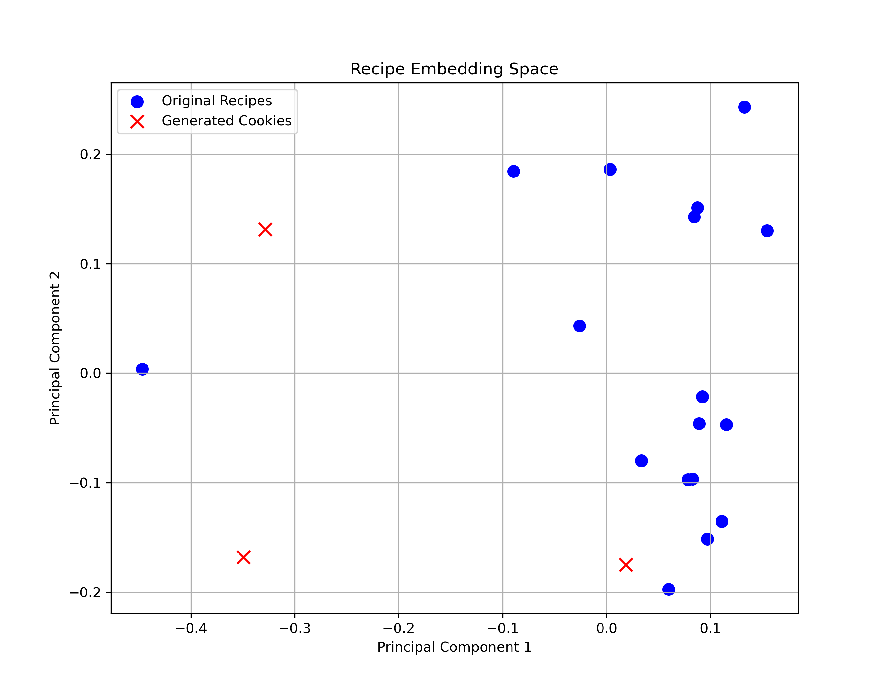

# The Great Bitwise Bake Off

A genetic algorithm that evolves novel cookie recipes from a knowledge base of
existing ones. Recipes are recombined through crossover and mutation, scored by
a fitness function balancing structural validity, ingredient diversity and
semantic novelty, and the most distinct high-scoring results are compiled into a
generated cookbook.

The design problem is that novelty and edibility pull against each other. A
recipe that shares nothing with the originals scores well on novelty and may not
be bakeable at all, so the fitness function has to reward difference while
enforcing the structure a cookie actually needs.

**The output:** [`cookbook.pdf`](cookbook.pdf) — the three selected recipes laid
out as a cookbook. **Full write-up:** [`report.pdf`](report.pdf).

## How it works

**Knowledge base.** 17 cookie recipes in a custom JSON schema, each ingredient
annotated with amount, unit, role (structure, fat, binder, leavening, flavour)
and type. Sweet and savoury recipes are both included so the search space has
something to recombine.

**Representation.** Every recipe, original or evolved, is a `CookieRecipe`.
Duplicate ingredients are merged by summing amounts, and toppings are capped at
the three largest to stop recipes accumulating clutter.

**Fitness.** Four components:

- *Structural validity* — a −10 penalty for missing any of structure, fat,
  binder or leavening. Severe, because a recipe missing these is not a cookie.
- *Ingredient diversity* — a reward for distinct normalised ingredients.
- *Distribution* — favours roughly three base ingredients, two to six flavour
  add-ins, and at least one topping.
- *Novelty* — one minus the maximum cosine similarity to any original recipe,
  using `all-MiniLM-L6-v2` embeddings of the ingredient text.

**Crossover** runs per ingredient category rather than across the whole recipe,
so bases mix with bases and toppings with toppings. With 30% probability an
entire category is inherited from one parent intact.

**Mutation** fires on 60% of offspring and adds, removes, replaces or rescales
an ingredient (amounts by a factor between 0.8 and 1.3). When adding a flavour
ingredient, rarer ingredients in the current population are preferred, which
pushes the search away from converging on the same few additions.

## Parameters

| Parameter | Value |
|---|---|
| Population size | 20 |
| Generations | 8 |
| Mutation rate | 0.6 |
| Crossover probability | 0.3 |
| Fitness threshold | 3 |
| Max mutation attempts | 5 |
| Embedding model | `all-MiniLM-L6-v2` |

Each run starts from a third original recipes and two-thirds mutants of them.

## Results

160 recipes across eight generations. In the final population, 65% scored high
fitness (≥ 7), 25% medium (3–7) and 10% low (< 3).

The three selected recipes:

| Recipe | Fitness |
|---|---|
| Apples Cheese Cheddar Cookie | 9.34 |
| Blueberry Sesame Pistachios Cookie | 8.22 |
| Jalapenos Almonds Brown Cookie | 7.40 |

Average pairwise Jaccard distance across their major flavour add-ins is 1.000 —
no overlap at all between the three. Across all ingredients, average pairwise
Jaccard similarity is 0.208, which comes from the shared base (flour, egg,
baking powder) that the structural constraint requires every recipe to have.



The PCA plot shows the generated recipes sitting clearly outside the cluster of
originals, which is the novelty term doing its job.

The interesting outputs were the ones that paired savoury with sweet — apple
with cheddar, jalapeño with lavender. Those are combinations the fitness
function permitted rather than sought, and they are the cases where the search
found something a person probably would not have written down.

## Running it

```bash
pip install -r requirements.txt
python cookie_generator.py
```

The script evolves the population, prints the top recipes with their fitness
scores and ingredient breakdowns, and saves the PCA plot of the embedding space.

Runs are stochastic, so the exact recipes differ each time. The system is meant
to explore the space, not to reproduce a fixed output.

## Repository contents

| File | Purpose |
|---|---|
| `recipes.json` | knowledge base, 17 annotated cookie recipes |
| `cookie_generator.py` | representation, GA operators, fitness, selection, plotting |
| `Novelity.png` | PCA plot of original against generated recipes |
| `cookbook.pdf` | the generated cookbook — the three recipes laid out with AI-generated imagery |
| `report.pdf` | full write-up: method, fitness design, evaluation |

## Limitations

- Ingredient replacement has no culinary logic beyond the role constraint, so
  the structural penalty keeps recipes bakeable without making them sensible.
- Everything depends on the JSON knowledge base being well formed and richly
  annotated; sparse metadata degrades output quality directly.
- Novelty is measured by embedding distance, which captures lexical and semantic
  difference but says nothing about whether a recipe tastes good. Human
  evaluation was not part of this work.
- 17 source recipes is a small inspiring set for a genetic algorithm.

## Contributors

- Nallathambi Vethiappan
- Ekansh Khanulia
- Aparajita Saha
